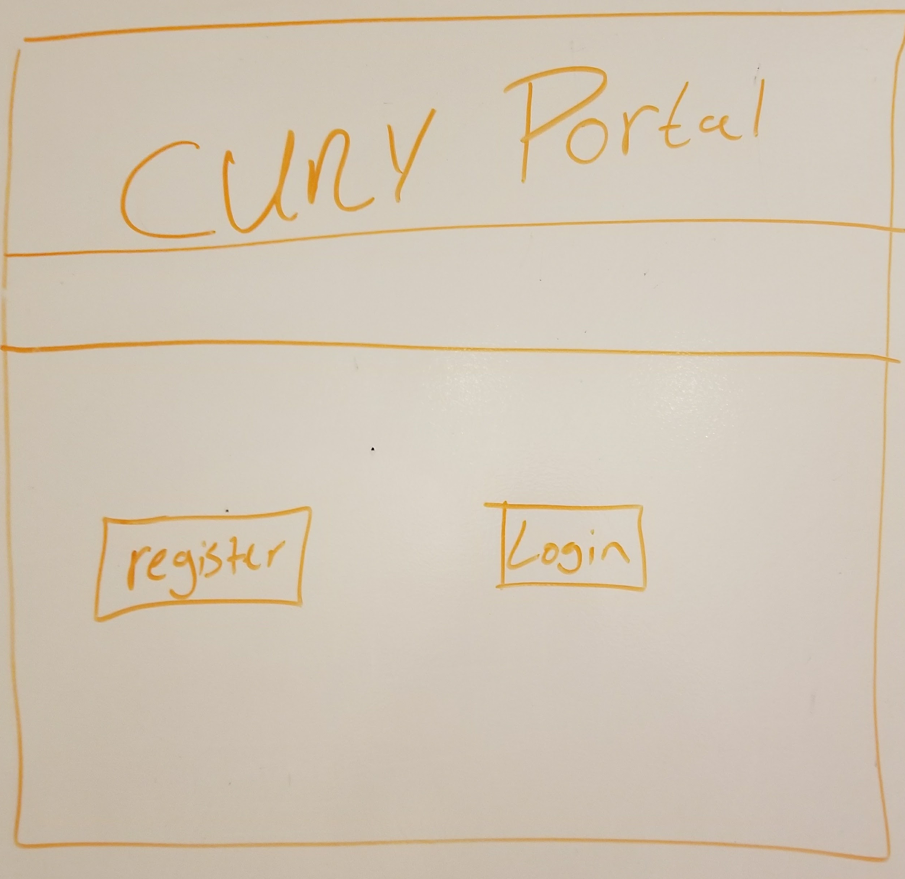
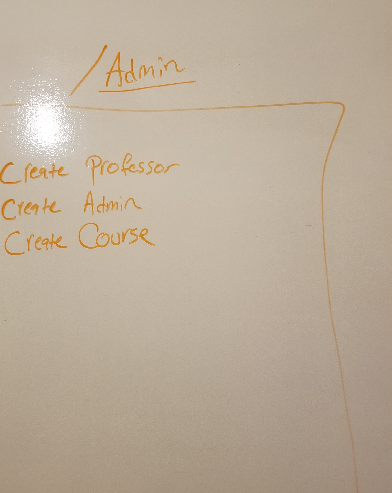
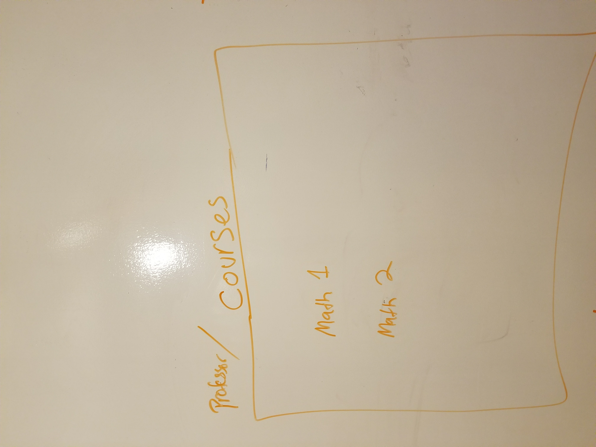
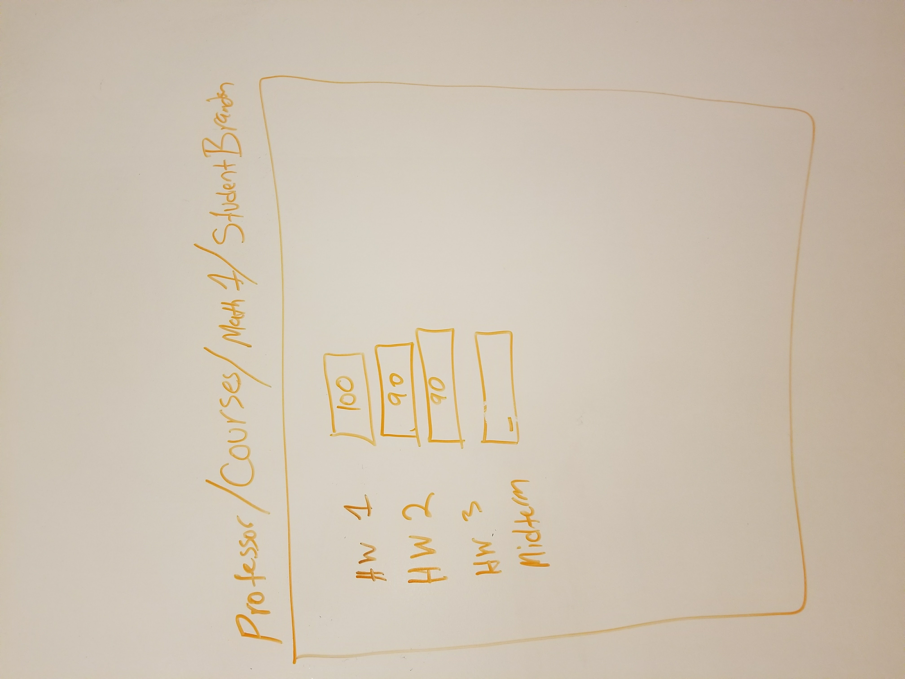
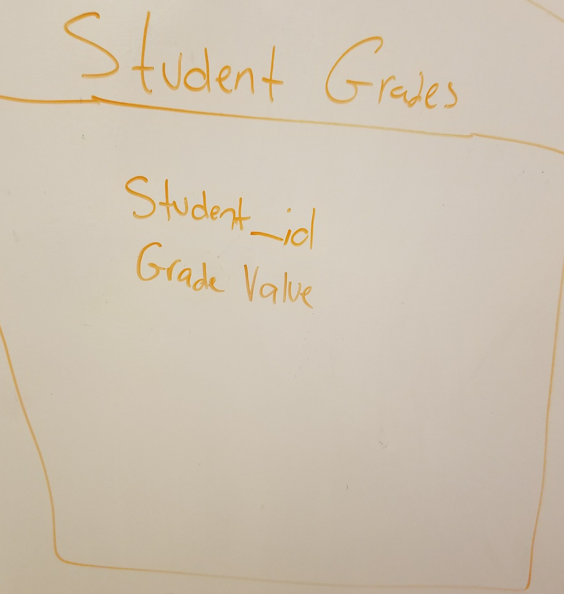
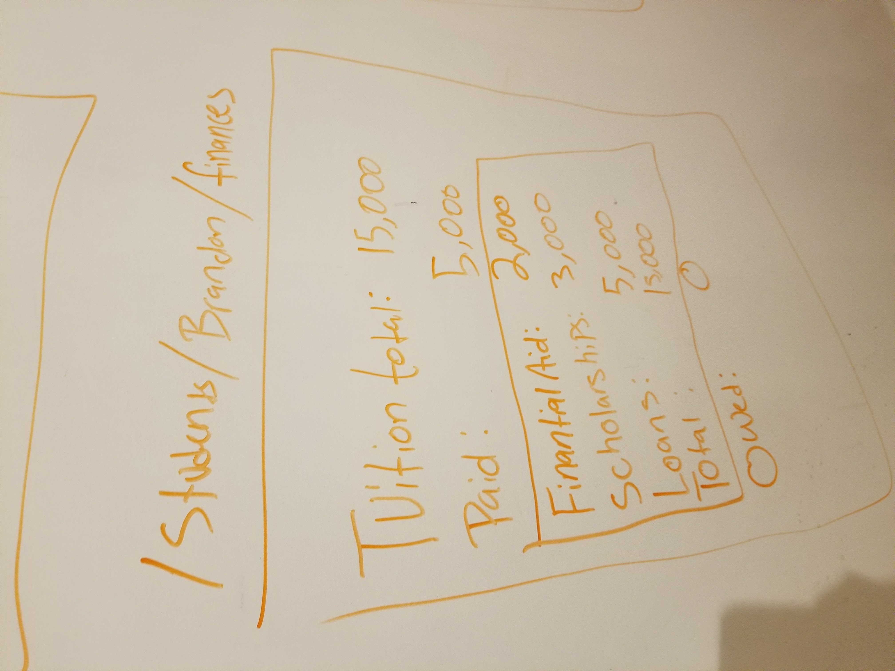
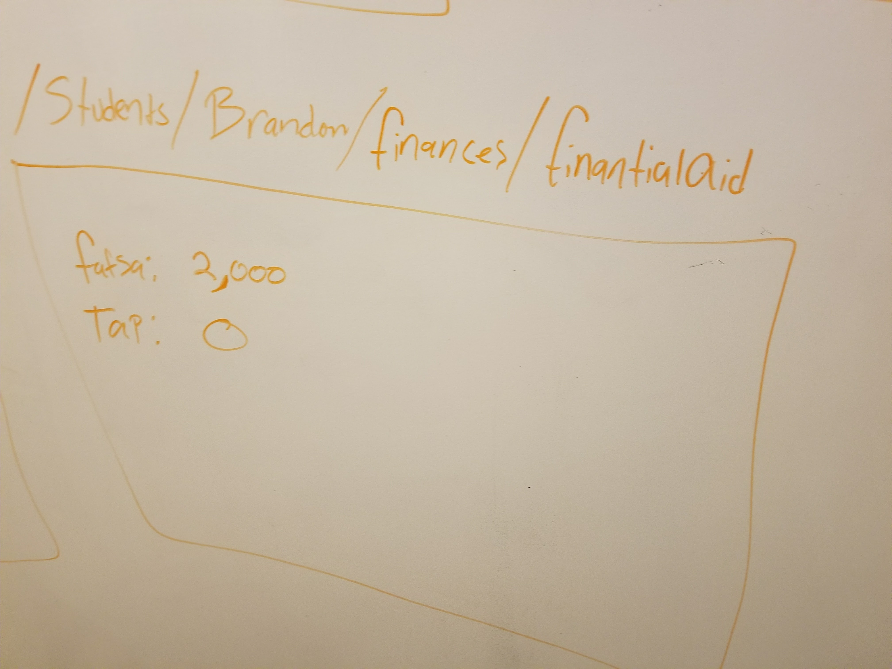
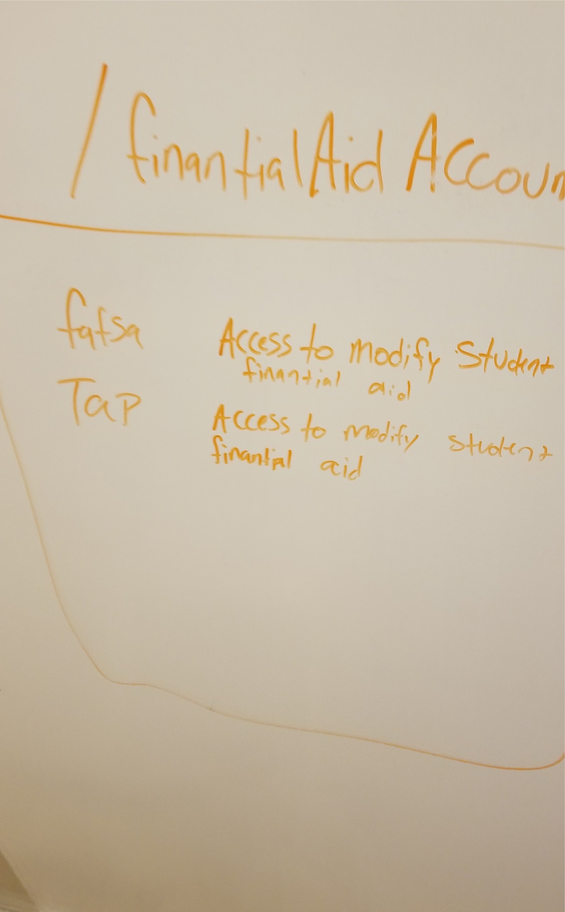

# Cuny-Replica

This app would be a remake of the current cuny system as it is not synched well with other servers.

# User Stories
* Cuny
    * Landing page would have 
    * Authentication
        * Students would have a register page
            * Students would create a user
        * Students would log in with their credentials
            * Automatically generates an account for all financial Aid Servers
            * Students would have access to 
                * Course History
                * Current Courses
                * Join courses
                * Rate courses
                * Backout of courses
                * Swap Courses
                * Pay tuition
                

        * Administrators would have a register page that needs acceptance from Administrator
        * Administrators would log in with their credentials
            * Administrators would be able to create courses
        * Professors would have a register page that needs acceptance from Admin
        * Professors would log in with their credentials
            * Professors could view their students
            * Professors could request a new course to administration
            * Professors could give grades
                * Midterm
                * Final

* Financial Aid
    * Administrators would have a register page that needs acceptance from another admin
    * Admin would would log in with their credentials
    * Admin could view data from a students account
    * Admin could have toggles for data but cannot directly influence the data because much would be automated

# Wireframes

# MVP Structure

### Databases
* Cuny Database
* Financial Aid Database

### Model
* user
    * t
        * username 
        * email
        * first name
        * last name
        * date of birth
        * emergency contact 
        * password_digest
        * token

* admin < user
    * t

* professor < user
    * t

    * has_many courses
    * has_many students through courses
* course
    * t
        * name
    * belongs_to professor
    * has_and_belongs_to_many students
    * has_and_belongs_to_many grades
* financial_account < user
    * t
    * belongs_to student
    * has_one 
* financial 
    * t
        * amount
* fafsa < financial
    * t 
    * belongs_to student
* tap < financial
    * t 
    * belongs_to student
* loan < financial
    * t 
    * belongs_to student
* scholarship < financial
    * t 
        * amount
    * belongs_to student
* student < user
    * t

    * has_and_belongs_to_many courses
    * has_many_grades through courses
    * has_one fafsa
    * has_one tap
    * has_one loan
    * has_one scholarship
* grade 
    * t
        * value
    * belongs_to student
    * has_and_belongs_to_many course

# Technologies
* Front End
    * React
* Back End Server
    * Rails Backend
        * Faker for generating Students and Teachers
    * Authentication O-auth

* Database 
    * Postgresql

# Pre challenges
* Making multiple servers talk to eachother
* SPA page routes are viewable to everyone, so how to make this less of an issue
    * By allowing teachers to be students, we add functionality to spa's allowing any user to access a path, the trick will be the data coming from the server side
    * This project would have been better as a non spa because of this issue, however SPA's have better user experience

# Issues
* Handling Relations vs Inheritence 
    * Cant build inheritance tree, more like only one level because that would be changing the structure of the database probably.
    * Usable in situations where all the tables would be exactly the same

* Financial Accounts have an associated person id because it is based off a user. This is sloppy and should be removed when possible. 

* When one financial account is created a user account is also created, this is a bit sloppy, should refactor.

# License
Copyright © 2017